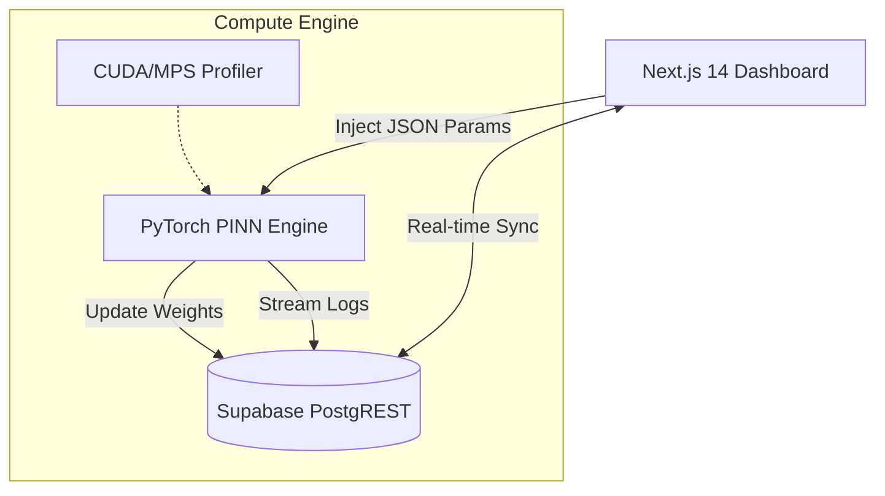

# PINN-WaveLab: Neural Maxwell Solver for Computational Electromagnetics & Metasurface Inverse Design

[](https://nextjs.org/)
[](https://pytorch.org/)
[](https://supabase.com/)

## 1. Scientific Background & Problem Statement

전통적인 전자기파 수치 해석 기법인 **FDTD(Finite-Difference Time-Domain)** 및 **FEM(Finite Element Method)**은 수십 년간 표준으로 사용되어 왔으나, 현대의 복잡한 광학 설계 문제에서 다음과 같은 근본적인 한계에 직면한다:

- **Computational Cost of Meshing:** 파장의 수 분의 일 수준으로 격자(Mesh)를 나누어야 하며, 복잡한 기하학적 구조에서는 격자 생성 자체에 막대한 연산 비용이 소요된다.
- **Non-differentiability:** 이산화된 격자 기반의 시뮬레이션은 최적화 과정에서 기울기(Gradient) 정보를 직접적으로 활용하기 어려워, 메타표면(Metasurface) 설계와 같은 역설계(Inverse Design) 문제에서 효율성이 저하된다.

본 프로젝트인 **PINN-WaveLab**은 물리 법칙을 신경망의 손실 함수에 내재화하는 **Physics-Informed Neural Networks(PINN)**를 제안하여, 격자 생성 없이(Mesh-free) 연속적인 도메인에서 전자파 거동을 해석하고, 전체 파이프라인의 미분 가능성(Differentiability)을 확보하여 최적의 광학 소자 설계를 가속화한다.

---

## 2. Methodology: Neural Maxwell Solver

### 2.1 Governing Equation (Helmholtz)
무손실 매질 내에서 조화 진동(Harmonic) 상태의 전자기파 전파는 Maxwell 방정식으로부터 유도된 **Helmholtz Equation**을 따른다:

$$ \nabla^2 \mathbf{E}(\mathbf{r}) + k^2 \mathbf{E}(\mathbf{r}) = 0 $$

신경망 $\Phi_\theta(\mathbf{r})$는 입력 위치 $\mathbf{r}$에 대해 전계(Electric Field) $\mathbf{E}$를 출력하며, 자동 미분(Automatic Differentiation)을 통해 위 방정식을 만족하도록 최적화된다.

### 2.2 SIREN (Sinusoidal Representation Networks) 채택 이유
일반적인 ReLU 활성화 함수는 고주파(High-frequency) 진폭 및 위상 변화를 학습하는 데 한계가 있다. 본 프레임워크는 **SIREN**을 채택하여, 주기적 특성을 가진 전자기파의 복잡한 위상 및 고계 도함수(High-order Derivatives)를 정밀하게 복원한다:

$$ \phi_i(\mathbf{x}) = \sin(\omega_0 \cdot \mathbf{W}_i \mathbf{x} + \mathbf{b}_i) $$

### 2.3 Multi-objective Loss Function
물리적 정합성과 경계 조건의 일관성을 동시에 확보하기 위해 다음과 같은 통합 손실 함수를 최소화한다:

$$ \mathcal{L}_{total} = \lambda_{BC} \mathcal{L}_{BC} + \lambda_{PDE} \mathcal{L}_{PDE} $$

- **$\mathcal{L}_{PDE} = \frac{1}{N} \sum_{i=1}^N \| \nabla^2 \Phi_\theta(\mathbf{r}_i) + k^2 \Phi_\theta(\mathbf{r}_i) \|^2$**: 물리 법칙 준수 강제.
- **$\mathcal{L}_{BC}$**: Dirichlet 및 Neumann 경계 조건과 소스항(Source term)에 대한 부합성 강제.

---

## 3. System Architecture

연구 데이터의 실시간성과 연산의 고성능을 동시에 구현하기 위해 **Decoupled Full-stack Architecture**를 채택하였다.



- **Frontend:** Next.js 14의 Server Components 및 SSE(Server-Sent Events)를 통해 시뮬레이션 수렴 과정과 예측된 Wavefield를 실시간으로 스트리밍한다.
- **Backend:** PyTorch 기반 엔진이 Apple Silicon(MPS) 및 NVIDIA GPU(CUDA) 가속을 활용하여 물리 손실을 최적화한다.

---

## 4. Key Research Use-cases

### 4.1 Forward Simulation: Scattering & Diffraction
복잡한 금속 나노 입자 또는 유전체 계면에서의 전자파 산란 패턴을 해석한다. PINN의 연속적 특성 덕분에 임의의 지점에서의 전계 강도를 해석적(Analytical) 수준의 정밀도로 도출한다.

### 4.2 Inverse Design: Neural Metasurface Optimization
특정 위치(Focal Point)에 에너지를 집중시키거나, 특정한 위상 변조(Phase Gradient)를 수행하는 소자의 굴절률 또는 구조 정보를 역설계한다. 시뮬레이션 전체가 미분 가능하므로, 경사 하강법(Gradient Descent)을 통해 소자 파라미터를 직접 최적화할 수 있다.

---

## 5. Implementation & Setup

### Requirements
- **Hardware:** Apple Silicon (M1/M2/M3) or NVIDIA GPU (Compute Capability 7.0+)
- **Software:** Python 3.10+, Node.js 18+, PyTorch 2.0+, Supabase CLI

### Quick Start
```bash
# 1. Repository Clone
git clone https://github.com/haeseong-kwon/pinn-wavelab.git
cd pinn-wavelab

# 2. Python Backend Setup
pip install -r requirements.txt
python main.py --mode train --engine mps

# 3. Frontend Setup
npm install
npm run dev
```

---

## Author & Research Identity
- **Author:** 권해성 (Hanyang University, Computer Science)
- **Research Interest:** Computational Electromagnetics (CEM), Physics-Informed ML, AI-based Nanophotonic Design & Metasurface Optimization
- **Contact:** [haeseong@hanyang.ac.kr](mailto:haeseong@hanyang.ac.kr)

*Developed for Wave-AI Lab (Prof. Haejun Chung), Hanyang University.*
