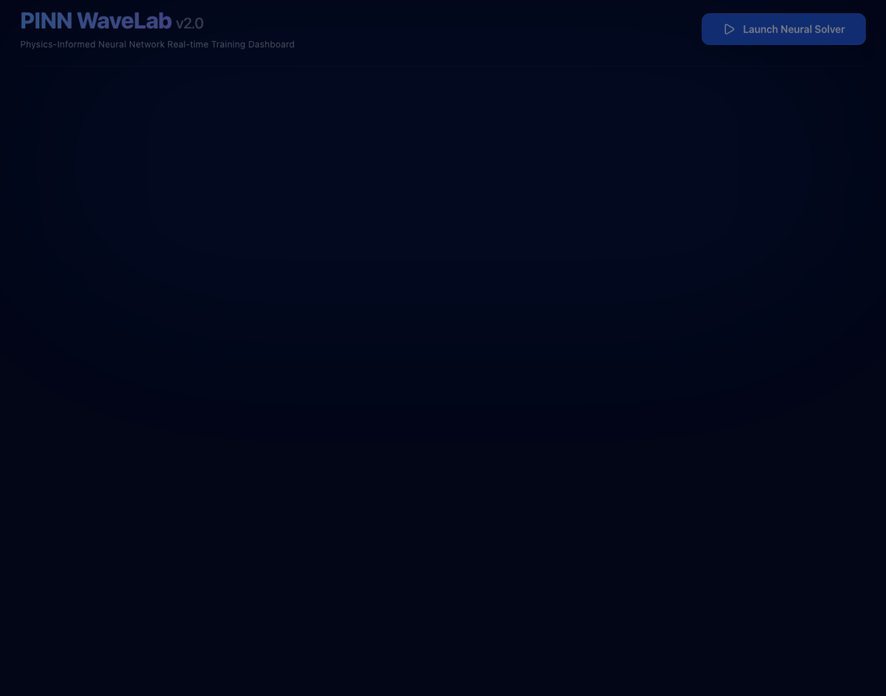
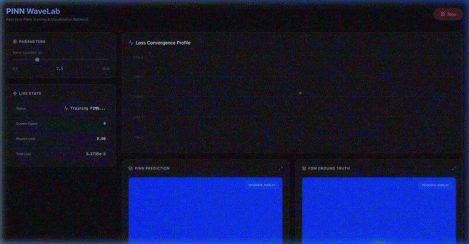
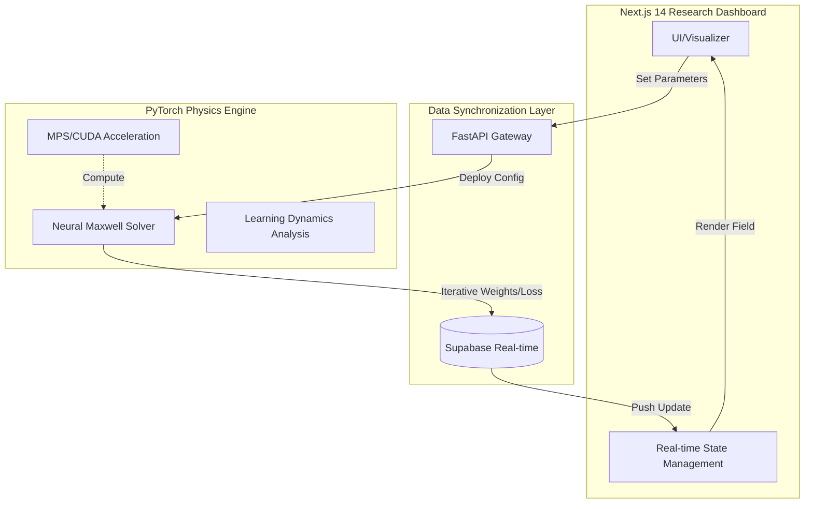

<div align="center">
  
  <br />
  <h3>PINN-WaveLab: Neural Maxwell Solver Dynamic Demo</h3>
  <p>Physics-Informed Neural Network(PINN)가 물리 법칙을 학습하며 2D 전자기파 산란 패턴을 실시간으로 재구성하는 시뮬레이션 과정입니다.</p>
</div>

# [Research Report] PINN-WaveLab: Neural Maxwell Solver for Computational Electromagnetics & Metasurface Inverse Design

## 0. Simulation Results Summary

> **SIREN 기반 PINN 모델의 학습 성능 및 손실 함수(Loss) 수렴도 시각화 결과**

## 1. Research Background & Motivation

현대 전자기학 및 나노 광학 설계에서 **FDTD(Finite-Difference Time-Domain)** 및 **FEM(Finite Element Method)**과 같은 고전적 수치해석 기법은 표준적인 도구로 자리 잡았다. 그러나 이러한 기법들은 복잡한 기하학적 구조를 다룰 때 다음과 같은 근본적인 병목 현상에 직면한다:

- **Meshing Overhead & Multi-scale Challenges:** 파장의 수 분의 일 수준으로 도메인을 분할해야 하는 격자 생성(Meshing) 과정은 기학학적 복잡도가 증가함에 따라 기하급수적인 연산 비용을 초래한다. 특히 나노 스케일 소자와 거시적 전파 환경이 공존하는 멀티스케일 문제에서 메모리 효율성이 급격히 저하된다.
- **Non-differentiability in Inverse Design:** 이산화된 격자 기반 시뮬레이션은 설계 파라미터에 대한 직접적인 구배(Gradient) 정보를 제공하지 않는다. 이는 메타표면(Metasurface) 최적화와 같은 역설계(Inverse Design) 문제에서 유전 알고리즘(GA)이나 입자 군집 최적화(PSO)와 같은 블랙박스 최적화에 의존하게 만들며, 설계 효율을 저하시키는 주요 원인이 된다.

본 연구에서는 물리 법칙을 신경망의 손실 함수에 직접 주입(Physics-Embedding)하는 **Physics-Informed Neural Networks(PINN)**를 제안한다. 이를 통해 격자 없는(Mesh-free) 연속 도메인 해석을 달성하고, 시뮬레이션 전체를 미분 가능한(Differentiable) 연산 그래프로 재구성하여 최적화 루프와의 직접적인 통합을 실현한다.

---

## 2. Physical Modeling & PINN Methodology

### 2.1 Governing Equations & Physics Loss Formulation
무손실 매질 내에서 조화 진동(Harmonic) 상태의 전자기파 전파는 Maxwell 방정식으로부터 유도된 **Helmholtz Equation**으로 기술된다. 본 프레임워크는 신경망 $\Phi_\theta(\mathbf{r})$가 입력 위치 $\mathbf{r}$에서의 전계(Electric Field) $\mathbf{E}$를 근사하도록 학습하며, 다음과 같은 PDE 잔차(Residual)를 최소화한다:

$$ \mathcal{R}_{PDE}(\mathbf{r}) = \nabla^2 \Phi_\theta(\mathbf{r}) + k^2 \Phi_\theta(\mathbf{r}) = 0 $$

학습을 위한 통합 손실 함수 $\mathcal{L}_{total}$는 물리 법칙 준수와 정합성을 위해 다음과 같이 구성된다:

$$ \mathcal{L}_{total} = \lambda_{PDE} \mathcal{L}_{PDE} + \lambda_{BC} \mathcal{L}_{BC} (+ \lambda_{IC} \mathcal{L}_{IC}) $$

- **Physics Loss ($\mathcal{L}_{PDE}$):** 자동 미분(Automatic Differentiation)을 통해 계산된 Helmholtz 방정식의 잔차 제곱 합.
- **Boundary/Initial Loss ($\mathcal{L}_{BC}, \mathcal{L}_{IC}$):** Dirichlet/Neumann 경계 조건 및 초기 파형(Source profile)과의 일치 여부를 강제.

### 2.2 SIREN (Sinusoidal Representation Networks)
전자기파의 고주파 성분 및 복잡한 위상 변화를 정밀하게 모사하기 위해, 기존의 ReLU 활성화 함수 대신 **SIREN**을 채택한다. SIREN은 주기적 활성화 함수를 사용하여 고계 도함수(High-order Derivatives) 내에서도 정보 손실 없이 파동의 물리적 특성을 보존하는 데 탁월한 성능을 보인다:

$$ \phi_i(\mathbf{x}) = \sin(\omega_0 \cdot \mathbf{W}_i \mathbf{x} + \mathbf{b}_i) $$

이를 통해 복잡한 산란체 주변의 급격한 전계 변화를 수치적 발산 없이 안정적으로 재구성한다.

---

## 3. Hybrid System Architecture

본 프로젝트는 고성능 계산 엔진과 사용자 중심의 인터페이스를 결합한 **Decoupled Real-time Hybrid Architecture**를 지향한다.

### 3.1 Workflow Strategy
시뮬레이션 파라미터의 변경이 실시간으로 물리 엔진에 반영되고, 수렴 과정이 대시보드에 즉시 시각화되는 구조를 채택하였다.



### 3.2 Technical Integration
- **Next.js 14 & Supabase:** 연구자가 브라우저 상에서 시뮬레이션 수렴도와 예측된 Wavefield를 실시간으로 모니터링할 수 있는 반응형 환경을 제공한다.
- **Asynchronous Optimization:** 연산 집약적인 PINN 학습은 백엔드에서 비동기로 수행되며, 결과 데이터는 WebSocket 및 Real-time DB를 통해 스트리밍된다.

---

## 4. Research Capabilities & Use-cases

### 4.1 Forward Simulation: Scattering Pattern Reconstruction
복잡한 유전체 및 금속 산란체에 입사하는 파동의 거동을 해석한다. PINN의 연속적 특성 덕분에 격자 크기에 구애받지 않고 도메인 내 임의의 지점에서 해석적(Analytical) 정밀도를 가진 전계 강도를 도출할 수 있다. 이는 고주파 대역의 회절 및 간섭 현상 분석에서 강력한 이점을 가진다.

### 4.2 Inverse Design: Gradient-based Metasurface Optimization
본 프레임워크의 핵심 역량은 **Full Differentiability**에 있다. 시뮬레이션 엔진 전체가 PyTorch의 연산 그래프 상에 존재하므로, 타겟 Wavefield와 예측값 사이의 오차를 설계 파라미터(예: 소자의 굴절률 분포, 기하 구조)까지 역전파(Back-propagation)할 수 있다. 이는 수만 개의 파라미터를 가진 메타표면 설계를 단일 최적화 루프로 해결할 수 있음을 의미한다.

---

## 5. Implementation & Technical Specs

### 5.1 System Requirements
- **Language:** Python 3.10+ (Physics Core), TypeScript/Node.js 18+ (Interface)
- **Computing:** PyTorch 2.0+, SciPy, NumPy
- **Communication:** FastAPI, Supabase Python/JS SDK
- **Acceleration:** Apple Metal Performance Shaders (MPS) 지원 (MacBook Pro 로컬 가속 최적화)

### 5.2 Local Acceleration Setup (macOS/MPS)
NVIDIA GPU가 없는 환경에서도 MacBook Pro의 통합 메모리 아키텍처를 활용하여 고속 학습이 가능하도록 설정되어 있다:

```python
# Device abstraction logic
import torch
device = torch.device("mps" if torch.backends.mps.is_available() else "cuda" if torch.cuda.is_available() else "cpu")
model.to(device)
```

학습 실행 시 `--engine mps` 플래그를 통해 하드웨어 가속을 활성화할 수 있다.

---

### Author & Research Content
- **Author:** 권해성 (Hanyang University, Computer Science)
- **Contact:** [haeseong@hanyang.ac.kr](mailto:haeseong@hanyang.ac.kr)
- **Research Interest:** Physics-Informed Neural Networks (PINN), Electromagnetic Inverse Design, Computational Photonics, Metasurface Optimization

